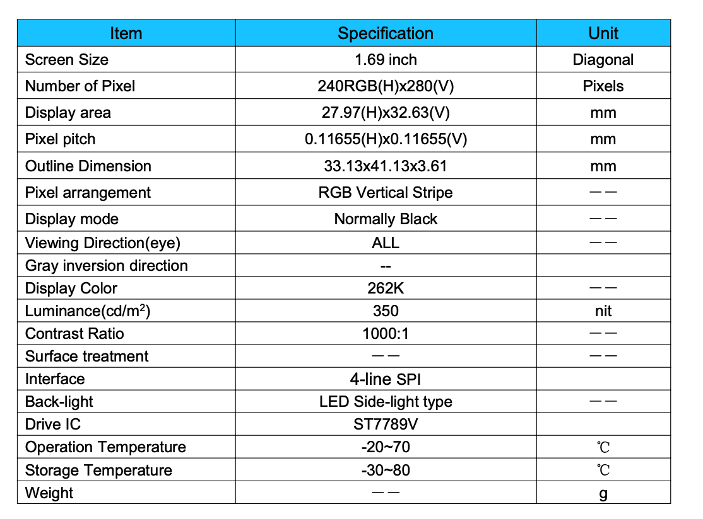
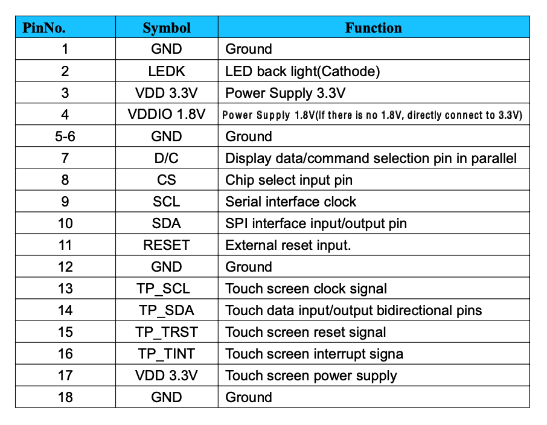
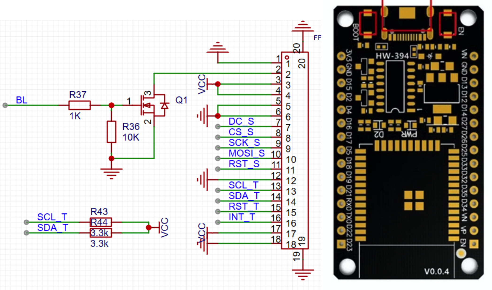

# ESP + lvgl + tft(ST7789v + CST816T)触控显示屏

## 参考
[st7789-tft-esp32](https://github.com/nilathj/st7789-tft-esp32.git)

# P169H002-CTP（1.69 TFT触控显示屏）

## 显示屏配置




## 转接头引脚







### **显示屏（ST7789v）接线（SPI接口）**

| **ST7789引脚** |   **功能**    |    **ESP32引脚**    |          **备注**          |
| :------------: | :-----------: | :-----------------: | :------------------------: |
|      VCC       | 电源（3.3V）  |        3.3V         |   确保电压匹配**1****5**   |
|      GND       |      地       |         GND         |            共地            |
|    SCL/SCK     |    SPI时钟    | GPIO 18 (VSPI_SCK)  | 默认SPI时钟引脚**1****7**  |
|    SDA/MOSI    |   SPI数据线   | GPIO 23 (VSPI_MOSI) |   主输出从输入**1****5**   |
|      RES       |     复位      |       GPIO 4        |     可自定义**1****6**     |
|       DC       | 数据/命令选择 |       GPIO 2        |  区分数据与命令**1****5**  |
|       CS       |     片选      |   GPIO 5 (或GND)    | 若仅单设备可接地**1****7** |
|      BLK       |   背光控制    |  GPIO 33 (或3.3V)   |  PWM调光或常亮**1****5**   |

### **触摸屏（CST816T）接线（I2C接口）**

```
触摸芯片类型：CST816T 是 I2C接口 的触摸芯片，不需要片选引脚（CS），而 TFT_eSPI 默认支持的是 SPI接口 的触摸芯片（如 XPT2046），后者需要 TOUCH_CS 引脚
```

| **CST816T引脚** |   **功能**   |   **ESP32引脚**   |          **备注**           |
| :-------------: | :----------: | :---------------: | :-------------------------: |
|       VCC       | 电源（3.3V） |       3.3V        | 与显示屏共用电源**8****10** |
|       GND       |      地      |        GND        |            共地             |
|       SCL       |   I2C时钟    | GPIO 22 (I2C_SCL) |  需上拉电阻（4.7kΩ）**10**  |
|       SDA       |  I2C数据线   | GPIO 21 (I2C_SDA) |  需上拉电阻（4.7kΩ）**10**  |
|       INT       |   中断信号   |      GPIO 9       |   触发触摸事件**8****10**   |
|       RST       |     复位     |      GPIO 10      |       可自定义**10**        |

### **关键注意事项**
1. 电源共用：ST7789v和CST816T可共用3.3V电源，但需确保电流足够（建议200mA以上）
2. SPI/I2C冲突：ESP32的默认I2C引脚（21/22）与SPI无冲突，可同时使用
3. 库配置：
    - ST7789v：使用TFT_eSPI库时，需修改User_Setup.h中的引脚定义
    - **CST816T**：需安装专用驱动库（如`CST816S`）并初始化I2C

**初始化ST7789v（TFT_eSPI库）**：

```cpp
#include <TFT_eSPI.h>
TFT_eSPI tft;
void setup() {
  tft.init();
  tft.setRotation(1);
  tft.fillScreen(TFT_BLACK);
  tft.setTextColor(TFT_WHITE);
  tft.println("Hello, ESP32!");
}
```

**初始化CST816T（I2C库）**：

```cpp
#include <Wire.h>
#include "CST816S.h"
CST816S touch(21, 22); // SDA, SCL
void setup() {
  Serial.begin(115200);
  touch.begin();
}
void loop() {
  if (touch.available()) {
    Serial.print("X: "); Serial.print(touch.getX());
    Serial.print(" Y: "); Serial.println(touch.getY());
  }
}
```

# RES与RST区别
在电子设计中，`RES`（ST7789v）和`RST`（CST816T）虽然都是复位引脚，但命名差异主要源于以下原因：

1. **厂商命名习惯**

    - ST7789v：由Sitronix（硅创电子）设计，其数据手册中明确将复位引脚标注为RES

      （Reset的缩写），符合该厂商对SPI显示驱动芯片的命名惯例

    - CST816T：由汇顶科技（Goodix）或其他触控芯片厂商设计，通常采用RST（Reset的简写），这是触控芯片领域的常见命名方式

2. **功能侧重点差异**

    - `RES`（ST7789v）：用于显示屏控制器的硬件复位，需严格遵循初始化时序（如低电平脉冲宽度），命名可能强调“复位信号”（RESet Signal）的时序特性
    - `RST`（CST816T）：触控芯片的复位可能更注重快速响应（如中断唤醒后的复位），命名简化（RST）以突出高效性

3. **行业通用性**

    - 显示驱动芯片（如ST7789v）常与SPI接口配合，RES命名在显示领域更普遍
    - 触控芯片（如CST816T）多通过I2C通信，`RST`命名在触控方案中更常见

